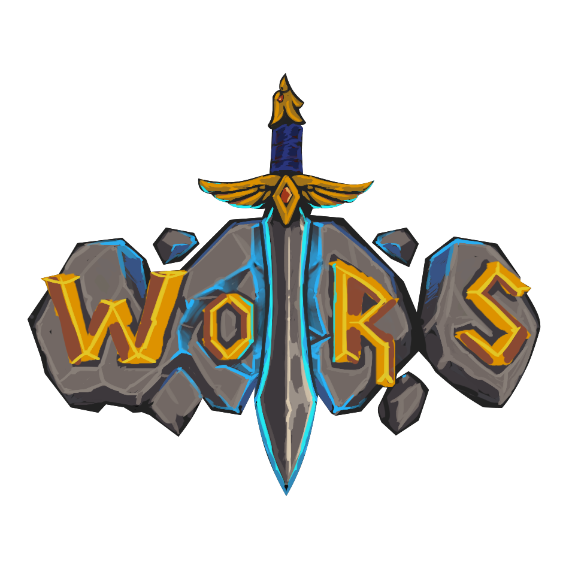

<p align="center">
  
</p>

# WoRS Plugins
This is the public repository for the plugins found in-game on WoRS.

# Creating a new Plugin
Request access access to plugin development in the [WoRS Discord](https://discord.gg/wors)

## How this works
Plugins created must be on GitHub. They will be forked as a new repo part of this GitHub Org. You can easily submit pull requests to get updates pushed to your plugin as needed.
All plugins (addons) must be on an approved list before they will be usable in game. 

## Plugin (addon) Guidelines
* Do **not** create something exploitative, or **clearly** detrimental to / circumventing the intended gameplay. If you find something or feel something you made might be abusive, feel free to DM WoRS Staff, or report it as a bug. 
* * Not following the above could result in you losing access to WoRS permanently, and if severe enough, Ascension as well. 

* Keep Plugins focused on what they say they do. There is really no limit on how many plugins we have.

* Please fill out your .toc fully!
It is important to include both `## Notes:` and `## DefaultState: disabled.`
Here's a template:
```toc
## Interface: 30300
## Title: My Plugin
## Notes: About My Plugin
## Author: Me
## Version: 1.0.0
## DefaultState: disabled
```
`DefaultState: disabled` means plugins will be opt-in for everyone, similar to enabling runelite plugins. Make sure to explain your plugin in notes! Include your /commands if it has them!

## Resources:
Enable the plugin (addon) `Ascension_UIDevelopmentTools`. You can use the console on this (`/luaconsole`) to search for a ton of stuff like functions, events, etc.. This also gives a better `/etrace` 

Many libraries are part of the Ascension base patches. (ex Ace3). You can search these in the luaconsole as well.

Szyler's Discord is specifically for Ascension addon development. <https://discord.gg/GmeSCJGdzs> Lots of questions have probably already been answered here.

WoRS uses Ascension as a base, and Ascension has an absolute ton of new functions, utilities, templates, etc.. which make plugin/addon development a lot easier. 
If you're trying to solve how to do something, create a certain style of frame, etc.. there is likely a way to do it already. Ideally we aren't reinventing the wheel with every plugin made. You can always ask @andrew6180 if there's a way to accomplish something already (or request its be added).
